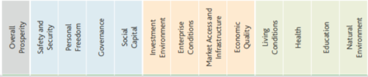

<h1> Предсказание индекса счастья в регионах России </h1>
<h2> Команда "Многоугольник" </h2>

Автоматизация и совершенствование измерения качества жизни населения в населенных пунктах регионов, повышение точности данной оценки. 
Исходная информация о задача проекта взята <a href = 'https://datamasters.ru/digital_solutions_library/community/sol5'> отсюда</a>

<h2> Задача проекта </h2>

Улучшения качества жизни в странах мира, в регионах России по выделенным признакам. 

<h2> Описание проблемы</h2>
Проблема улучшения качества жизни в странах мира, в регионах России и отдельно взятых муниципальных образованиях является одной из важнейнейшей стратегических задач в современном мире. От решения проблем качества жизни населения зависят темпы экономическго развития и его направленность, а также социальная, политическая, экономическая стабильность. кроме того, наиболее актуальным вопросом в настоящее время является сглаживание межмуниципальных раличий в условиях жизни населений в разных регионах России. </h2>

<h2> План реализации проекта</h2>
<ul>
  <li> Формирование команды, распределение ролей (см. ниже в "Описание команды")</li>
  <li> Изучить предметную область (см. ниже в "Описание предметной области")</li>
  <li> Выделить признаки для предсказания индекса счастья (см. ниже в "Описание признаков")</li>
  <li> Произвести сбор данных по выделенным признакам (см. ниже в "Выделенные источники для сбора данных")</li>
  <li> Составить прототип системы (см. ниже в "Описание прототипа системы")</li>
  <li> Выделить компоненты будущей системы (см. ниже в "Компоненты системы") </li>
  <li> Составить архитектуру системы (см. ниже в "Архитектура системы") </li>
  <li> Составить модель данных системы (см. ниже в "Модель данных системы")</li>
  <li> Составить набор данных. Произвести анализ набора данных (см. в блокноте "Предобработка и анализ данных") </li>
  <li> Первичное обучение на выбранных моделях. Выводы. (см. в блокноте "Первичное обучение на моделях") </li>
  <li> Подготовка Pipeline. (см. в блокноте "Подготовка pipeline") </li>
  <li> Подготовка продукта. (см. в разделе "Подготовка продукта") </li>
  <li> Выводы. Описание перспективы развития проекта (см. в разделе "Выводы") </li>
 </ul>

<h2> Описание команды и ее роли </h2>

 В команде собраны ответственные и позитивные участники, 
<ul>
  <li> Алена Рыбакина – data scientist, модератор</li>
  <li> Павел Свинов - data scientist </li>
  <li> Андрей Жарков – работа с данными </li>
  <li> Максим Степанов – презентор </li>
  <li> Антон Плотников – разработчик </li>
  <li> Юрий Руденко – работа с данными </li>
  <li> Андрей Зиборов – модератор </li>
</ul>

<h2> Описание предметной области </h2>

Предметная область хорошо отражена <a href = 'https://app.mindmup.com/map/_free/2021/03/3565838083fa11eb8a19576c5ac89eba'>в нашем MindMap</a>

 Для начала мы начали исследование области определения с того, как рассчитывается индекс счастья. Мы воспользовались <a href='https://www.marketing-mba.ru/article/v3_14/Pashkus_V.pdf'> данным источником ("Качество жизни: понятие, подходы, оценка" Пашкус В.Ю., Красникова Т. С.)</a>

Авторы описывают индекс счастья, как самый оригинальный из рассчитываемых индексов. По словам составителей рейтинга, его идея очень проста — «сравнить то, что мы вкладываем
(ресурсы), и что мы в итоге получаем (продолжительность жизни и степень удовлетворенности ею).»

 Изучая ее, мы выяснили, что на качество жизни людей влияют факторы:

  <li>социальное самочувствие людей или групп людей: Социальное самочувствие изучается в контекстах удовлетворённости человека различными сторонами жизни и изучается через социальные настроения</li>
  <li>восприятие индивидами их положения в жизни в контексте культуры и системе ценностей, в которых они живут, в соответствии с целями, ожиданиями, нормами и заботами: В 2009 году выпущен доклад Комиссии по основным показателям экономической деятельности и социального прогресса (комиссия Стиглица-Сена-Фитусси), в котором утверждается, что показатель качества жизни является более разумным для использования в качестве критерия экономического развития, чем ВВП</li>
  <li>качество жизни можно рассматривать как некую меру потребления тех или иных благ: Так называемый «объективный подход» к оценке качества жизни и есть подход, основанный на объективных условиях жизнедеятельности людей, качества как физической, так и социальной окружающей сред, в которой живет человек. Поэтому, качество жизни, как подчёркивают Дж. Стиглиц, А. Сен и Ж.-П. Фитусси, это «целый спектр факторов, которые мы ценим в жизни, выходящие за рамки ее материальной стороны». не рассматриваем зарплаты</li>
  <li>прямо зависит от удовлетворенности ею и от ощущаемого счастья</li>
  </ul>
  
 Автор пояснил, как можно его измерить. Индекс счастья рассчитывается по трем параметрам.

  <ul>
  <li>Первый параметр – воспринимаемое счастье (удовлетворенность жизнью);</li>
  <li>Второй параметр – ожидаемая продолжительность жизни;</li>
  <li>Третий параметр – экологическое благополучие, то есть необходимые для обеспечения благополучной жизни граждан того или иного государства природные ресурсы </li>
  </ul>

Опишем кратко, что они из себя представляют.

Экономическое здоровье: определяется с помощью прямых опросов граждан и оценки экономических показателей, таких как потребительские кредиты, средний доход на коэффициент индекса потребительских цен и распределение доходов в обществе;

Экологическое здоровье: определяется с помощью прямых опросов граждан и измерение экологических показателей, таких как загрязнение воздуха, шум и т.д.;

Физическая красота и здоровье: определяется с помощью оценки показателей физического здоровья населения страны (с учетом тяжелых заболеваний),

Психическое здоровье: определяется с помощью прямого опроса и оценки показателей психического здоровья, (в том числе таких, как использование антидепрессантов и рост или снижение психотерапии пациентов);

Здоровая работа: определяется с помощью прямого опроса и измерения трудовых показателей, таких, как пособие по безработице, смены места работы, удобства рабочего места, анализа разнообразных жалоб и исков;

Социальное здоровье: определяется с помощью прямого опроса и оценки социальных показателей, таких как дискриминация, безопасность, количество разводов и семейно-бытовых конфликтов, количество жалоб и семейных исков, уровень преступности и т.д.

Политическое здоровье: обозначается с помощью прямого опроса и измерения политических показателей, таких как качество местной демократии, индивидуальной свободы и внешних конфликтов.

Другое исследование по вычислению индекса счастья есть в <a href = 'https://www.prosperity.com/rankings>исследовании Legatum Institute</a> и <a href = 'https://docs.prosperity.com/2916/0568/0539/The_Legatum_Prosperity_Index_2020.pdf'>The Legatum Prosperity Index. A tool for transformation (2020)</a>

  
 Здесь можно кратко все объяснить, лишь одной картинкой.

  

  
Выделенные признаки в исследовании Legatum Institute

  
 То есть, составляющими счастья человека являются: безопасность, личная свобода, доверие к правительству, социальный капитал, инвестиционная среда, условия предприятия, доступность торговли и инфраструктуре, экономическое качество, условия жизни, здоровье, образование, экология. Причем, заметьте, что выделенные признаки находятся в трех уровнях, как в пирамиде Маслоу. Здесь, пока граждане не будут удовлетворены качеством жизни на базовом уровне (верхняя голубая область), они не будут высоко ценить, то что у них есть на более высоком уровне (оранжевая и салатовая области).

  

 Мы решили взглянуть на проблему шире. Изучили в целом задачи, которые были поставлены перед исследователями по поиску индекса счастья. Выяснили, что можно вычислить индекс счастья, не только для отдельной страны, но и для отдельно взятого минисообщества, например, среди студентов университета, среди школьников в школах, среди работников на предприятиях. Причем данные показатели позволят не просто вычислить уровень удовлетворенности членов небольшого сообщества, но также определить проблемы из-за которых индекс счастья столь низок.

В рамках уже выбранной нами темы, мы не стали столь подробно описывать подробно данные статьи, но выписали ниже ссылки для ознакомления

<ul>
    <li><a href = 'https://www.researchgate.net/profile/Sirinthorn-Sinjindawong/publication/293427987_The_Development_of_Happy_Workplace_Index/links/56b8546208ae3c1b79b1edfb/The-Development-of-Happy-Workplace-Index.pdf>индекс счастья рабочего места</a></li>
    <li>Индекс счастья студентов</a></li>
  </ul>
  
 Также, мы обнаружили, что данная задача уже была решена участниками хакатона: Ермак М.А. и Босенко Р.А. Их работу можно увидеть <a href = 'https://git.asi.ru/solutions/world-ai-and-data-challenge/happyindex'> здесь </a>. Мы очень благодарны им за их труд и решение и некоторые части работ были взяты за онову нашего проекта, но также мы внесли свой вклад в развитие проекта. Об этом будет пояснено в некоторых разделах.

<h2> Описание признаков </h2>

 Исходя из того, что было выше, мы выделили такие признаки:

<ul>
  <li>Медианная зарплата</li>
  <li>Средняя продолжительность жизни</li>
  <li>Стоимость бензина в регионе</li>
  <li>Количество аварий на дорогах</li>
  <li>Уровень безработицы</li>
  <li>Уровень преступности</li>
  <li>Прожиточный минимум</li>
</ul>

<h2>Описание прототипа системы</h2>

 Мы составили макет сайта и разработали код. Об этом описано ниже

<h2>Описание компонентов системы</h2>

 Мы поняли, что необходимо для разработки нашего продукта. Об этом описано ниже

<table>
<tr>
	<td>Технология или библиотека</td>
	<td>В какой части системы используется</td>
	<td>Дополнение</td>
</tr>
<tr>
	<td>Frontend</td>
</tr>
<tr>
<td>Angular</td>
<td>Веб-приложение. Фреймворк</td>
</tr>
<tr>
	<td>Highcharts</td>
	<td>Для отрисовки и выделения региона</td>
	<td>Библиотека для создания графиков и карт</td>
</tr>
<tr>
	<td>Typescript</td>
	<td></td>
	<td>Язык программирования</td>
</tr>
<tr>
	<td>Backend</td>
</tr>
  <tr>
	<td>Scykit-learn</td>
	<td>Библиотека для обучения и предсказаний моделей</td>
	<td>Библиотека</td>
</tr>
   <tr>
	<td>Selenium</td>
	<td>Библиотека для сбора данных с внешних источников</td>
	<td>Библиотека</td>
</tr>
<tr>
	<td>Python</td>
	<td>Модели для обучения и организации pipeline</td>
	<td>Язык программирования</td>
</tr>
<tr>
	<td>MySQL</td>
	<td>Хранилище данных</td>
	<td>Система упраыления базами данных</td>
</tr>
<tr>
	<td>ApacheSpark</td>
	<td>Для разработки pipeline</td>
	<td>Библиотека</td>
</tr>
</table>

<h2>Описание архитектуры системы</h2>

 Теперь, мы можем изобразить архитектуру нашего проекта. 

 В целом наша система выглядит так: с помощью модуля для сбора данных мы собираем данные из выделенных источников для обучения и пресказания индекса счастья. Далее эти данные проходят через фильтр, чтобы отсеять пустые значения или ненужные признаки. Данные записываются в базу данных. Вся эта процедура выполняется в расках организованного pipeline - это вроде кнвеера с поэтапной обработкой данных. Для обучения и предсказания индекса счастья тоже нужно данные пропустить через pipeline предобработки данных для их нормализации и удаления пустых значений, если их пропустил фильтр. Данные предсказания записываются в базу данных.

 Далее для отображения индекса счастья для регионов происходит выборка данных из базы данных (регион и его индекс счастья) и они отображаются на вебсайте на карте России разделенная на регионы.

<h2>Описание модели данных системы</h2>

 Изобразим модель данных проекта и кратко опишем, что сущности и их атрибуты описывают в рамках нашей системы. 

У нас есть сущность для описания регионов России, с признаками: наименование региона и его индекс счастья

Далее мы выделили сущности по выделенным признаками предсказания: зарплата, продолжительность жизни, стоимость бензина в регионе, количество аварий на дорогах, уровень безработицы, количество преступности, прожиточный минимум. Стоит добавить, что как и по предсказанным признакам, мы рассматриваем стоимость бензина у разного топлива, количество аварий на 100 тысяч человек.

<h2>Подготовка продукта</h2>

 Когда основные функции описаны: выбрана модель для дальнейшего предсказания индекса счастья, составлен pipeline для сбора и предобработки данных, мы приступаем к финаьной части разработки нашего продукта. 

<h2>Выводы</h2>

 В ходе реализации проекта мы проши долгий и тернеситый путь в изучении модулей и приобретении опыта в реализации проекта. Очень благодарны за обучение и менторство А.Г.Кравец. Ее знания и опыт помогли нам грамотно составить проектную архитектуру, вывести идею проекта и довести его до конечной точки.

 Если говорить о дальнейшем развитии проекта, то тут можно в первую очередь размышлять о дополнительных признаков предсказания индекса счастья регионов России, а во-вторых, добавить описание проблем этих регионов. Также стоит отметить, что можно добавить предсказания индекса счастья не только для столь обширной области, но и взять локальную область для исследования: предприятия, университеты, колледжи или даже предсказания индекса счастья семьи. Но тут встает проблема о подготовки данных, как для обучения, так и для тестирования и не каждый пользователь способен будет проделать даннцю процедуру. Здесь встает вопрос о сопровождении продукта, то есть найма дополнительных специалистов-аналитиаков по сбору данных и формирования набора данных.

Если говорить о сопровождении продукта, то также встает вопрос о найме специалистов, как для ведения фронтенда, так и для ведения бекенда сайта, администратора и специалистов по данным для развития модели предсказания. Но данный вопрос можно решить с помощью составления бизнес-плана продукта.

